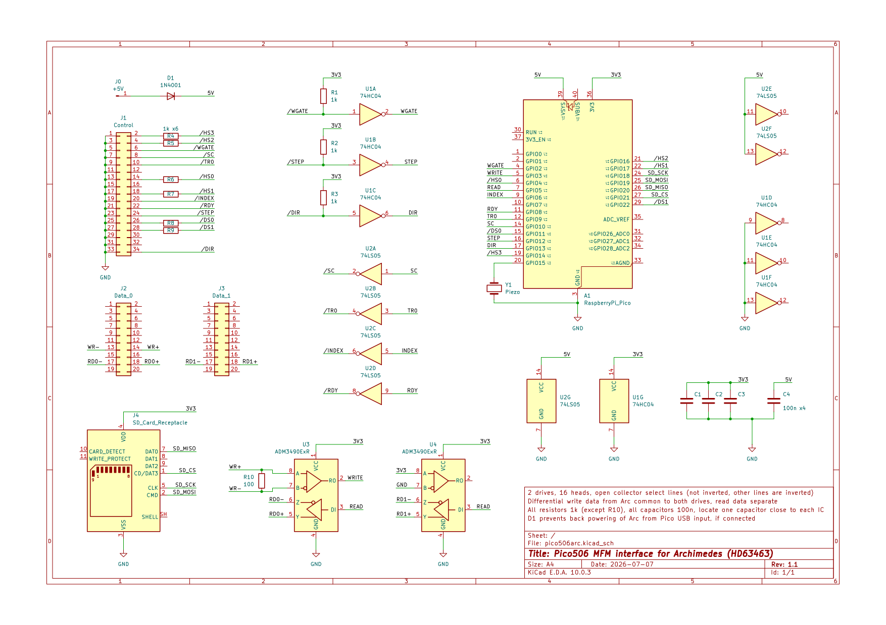

## Overview of updates for two MFM drives, each with up to 16 heads (Acorn Archimedes/HD63463)

- 4 head select lines are connected (inverted, so active high) and read in st506_head_irq()
- 2 drive select lines are connected (not inverted, so active low) and also read in st506_head_irq()
- Two drive images are concatenated into one file on the SD card
- When a new drive is selected, the old drive cylinder is written, the new drive last cylinder read, and the step PIO restarted
- Drive shape is 1024 cylinders, 11 heads (limited by available Pico RAM), 32 sectors per track, 256 byte sectors
- Track length is 20864 (MFM) bytes, corresponding to 3594 RPM with 10Mbit/s clock
- Currently reading works, format track doesn't work, write sector doesn't work reliably. WRITE_GATE timing to be investigated.



Original README follows:

# Pico506

The smallest and cheapest ST-506/RLL/MFM hard drive emulator.

*Read the full story of building this
project: [Emulating a 1987 proprietary RLL hard drive](https://kuba.szczodrzynski.pl/posts/toshiba-t1200/rll-hdd-emulator/)*

## Introduction

Pico506 is a simple, yet universal emulator of old RLL/MFM hard drives using the ST-506 signaling and control interface.

It is based on a Raspberry Pi Pico (RP2040 chip), which makes it extremely cheap to build. Thanks to the PIO
peripheral (Programmable I/O), it also offers pretty good performance and stability.

While it's primarily built to emulate a proprietary RLL(2,7) hard drive made by JVC (JD-3824), which uses a proprietary
26-pin interface, it should also be able to emulate any other drive using ST-506-compatible signaling.

As an added bonus, the Pico506 outputs a signal to drive a small piezo buzzer. This is inspired by
the [HDD Clicker](https://www.vogons.org/viewtopic.php?t=90047) and makes the emulator output "click" sounds whenever
the virtual drive is accessed.

## Prerequisites

While there is no dedicated hardware (PCB) for this project (yet), it is pretty simple to build on a perfboard. The
basic parts required are:

- Raspberry Pi Pico (or similar board with RP2040),
- SD/microSD card and a matching socket (MMC is not supported),
- a connector for the HDD controller of your PC,
- a level shifter/inverter circuit (more on that later),
- a piezo buzzer (without a built-in generator) - optional.

## Interface

The ST-506 interface uses a few control signals - it's probably best to refer to, for example,
Wikipedia ([ST-506/ST-412](https://en.wikipedia.org/wiki/ST-506/ST-412)) to learn more about the control interface.

At this point it's also worth to know the definitions of these common terms:

- **track** - a string of bits (flux transitions) stored on one side of a single HDD platter,
- **head** - a magnetic reading/writing head (like in a cassette player) that accesses one side of a single platter,
- **cylinder** - used to refer to the same track on all sides and all platters; in other words,
  `track length * head count = cylinder length`,
- **sector** - a logical part of one track that holds actual data.

To summarize, here are the most important control signals:

- `DRIVE_SELECT0/1/2/3` - selects one of at most four drives that the PC controller wants to talk to,
- `DRIVE_SELECTED` - indicates that the drive exists and is now selected,
- `HEAD_SELECT0/1/2/3` - up to four lines, which together form a 4-bit number of the currently selected head,
- `READY` - whether the drive has finished the spin-up,
- `TRACK_0` - whether the read/write head is positioned on track/cylinder 0,
- `INDEX` - pulse indicating the beginning of the current track (i.e. next sector will be the first on this track),
- `STEP` - performs a single-track step in the direction indicated by `DIR_IN`,
- `SEEK_COMPLETE` - whether the requested seek has been completed,
- `WRITE_GATE` - makes the head write data to the current track,
- `WRITE_FAULT` - indicates a problem during writing.

You might have noticed that the control signals are usually prefixed by `/` or `~`. This means that they are
active-low - a low voltage (~0V) on the line means "active", and high voltage (~5V) means "inactive". More on that
later.

The data signals are raw bit streams of magnetic flux transitions of the HDD's platters. The bits themselves, however,
depend on the type of encoding used in a particular hard drive -
see [Run-length limited](https://en.wikipedia.org/wiki/Run-length_limited) (RLL), or one of its common
variants, [Modified frequency modulation](https://en.wikipedia.org/wiki/Modified_frequency_modulation) (MFM).

Because the control signals are usually the same (or similar) across different drives (even when using different
encodings), Pico506 doesn't actually care about the data stored on the drive.

Instead, it transparently captures bit streams on the `WRITE` line and outputs them back on the `READ` line. The bit
data of the currently loaded cylinder is kept in RAM. Upon seeking, the modified data (if any) is written to the SD
card, and a new cylinder is loaded.

## Pin mapping

This is the default GPIO mapping used in the published source code. It can be changed freely (in `config.h`), under a
condition that `INDEX` and `SERVO_GATE` are using adjacent GPIOs (if you're using that signal, that is).

| GPIO | Direction | Function            |
|------|-----------|---------------------|
| GP0  | OUT       | UART TX             |
| GP1  | IN        | UART RX             |
| GP2  | IN        | HDD `WRITE_GATE`    |
| GP3  | IN        | HDD `WRITE`         |
| GP4  | IN        | HDD `HEAD_1`        |
| GP5  | OUT       | HDD `READ`          |
| GP6  | OUT       | HDD `INDEX`         |
| GP7  | OUT       | HDD `SERVO_GATE`    |
| GP8  | OUT       | HDD `READY`         |
| GP9  | OUT       | HDD `TRACK_0`       |
| GP10 | OUT       | HDD `SEEK_COMPLETE` |
| GP11 | IN        | HDD `SELECT`        |
| GP12 | IN        | HDD `STEP`          |
| GP13 | IN        | HDD `DIR_IN`        |
| GP15 | OUT       | Buzzer (optional)   |
| GP18 | OUT       | SD `SCK`            |
| GP19 | OUT       | SD `MOSI`           |
| GP20 | IN        | SD `MISO`           |
| GP21 | OUT       | SD `CS`             |

All the signals use **active-high** logic - that is, **opposite** to the normal ST-506 interface. This makes it
necessary to use an inverter, which fortunately also solves the problem of level shifting (3.3V vs 5V).

The inverter chip must be open-drain/open-collector. I personally tested it with 74LS05 and found that it works great.

Here's a simple connection diagram using two 74LS05s:

```
                                    +---------+
                       /WRITE_GATE -| o       |- +5V
 +3V3 ------[/\/\1k/\/\]------ GP2 -|         |- /WRITE
                           /HEAD_1 -|         |- GP3 ------[/\/\1k/\/\]------ +3V3
 +3V3 ------[/\/\1k/\/\]------ GP4 -|         |- GP5
                               GP6 -|         |- /READ ------[/\/\470/\/\]------ +5V
                            /INDEX -|         |- GP7
                               GND -|         |- /SERVO_GATE
                                    +---------+

                                    +---------+
                               GP8 -| o       |- +5V
                            /READY -|         |- GP9
                              GP10 -|         |- /TRACK_0
                    /SEEK_COMPLETE -|         |- /SELECT
                             /STEP -|         |- GP11 ------[/\/\1k/\/\]------ +3V3
+3V3 ------[/\/\1k/\/\]------ GP12 -|         |- /DIR_IN
                               GND -|         |- GP13 ------[/\/\1k/\/\]------ +3V3
                                    +---------+
```

The 1 kOhm pull-up resistors are necessary to make the inverters fast enough when converting 5V to 3.3V.

The 470 Ohm resistor on the `/READ` line is theoretically optional, and you might need to tweak the value a little bit.
A lower value makes the resulting inverted pulses "faster" (i.e. propagation is quicker, so pulses get longer).

As for the `SERVO_GATE` signal (which is not part of the ST-506 specification) - it's a special signal required for the
RLL(2,7) JVC JD-3824 drive. These drivers have 17 "pulses" per track, with 2 sectors between each "pulse". This pulse is
exactly what the `SERVO_GATE` signal means - between every two `INDEX` pulses, there are 17 `SERVO_GATE` pulses. For
emulating an ST-506 drive, this can be left unconnected.

Here's a little visualization of the JVC RLL interface:

```
INDEX         ___/‾‾‾‾‾‾‾‾‾‾‾‾\________________________________________________________
SERVO_GATE    ___/‾‾‾‾‾‾‾‾‾‾‾‾\____________________________________/‾‾‾‾‾‾‾‾‾‾‾‾\_______
READ          .../‾‾‾‾‾‾‾‾‾‾‾‾\....<...data...>....<...data...>..../‾‾‾‾‾‾‾‾‾‾‾‾\....... (repeat 17 times)
```

## Data configuration

Now, this is something that is specific to each hard drive, as it defines the geometry and timing of the signals.

The emulator assumes that each "logical" data bit encodes as 2 bits in MFM and RLL encodings. The entries named `LBYTES`
represent counts of "logical" data bytes (e.g. 512 for sector length).

To convert "logical" bytes into a real duration (in nanoseconds), use the following formula:

```
LENGTH_NS = (1 / (DATA_RATE * 2)) * (LBYTES * 8 * 2) * 1000 * 1000 * 1000
```

(8 - bits per byte, 2 - overhead of RLL/MFM encoding).

Configuration options (`config.h`) that should be adapted to each drive type:

- `DATA_RATE` - data transfer rate, in bits/second. Most MFM drives use 5 Mbps, and RLL(2,7) drives use 7.5 Mbps.
- `MARK_LBYTES` - length of the `INDEX` and `SERVO_GATE` pulses; use the formula above to convert. If in doubt, go for
  around 50 microseconds = 50,000 nanoseconds.
- `HEADER_LBYTES` - length of the sector header; using around 100 should be good.
- `DATA_LBYTES` - length of the sector data; should be 512 for most drives.
- `SECTORS_PER_PULSE` - see: `SERVO_GATE` description above. Use `1` unless emulating a JD-3824 drive, then use `2`.
- `PULSES_PER_TRACK` - in other words: `sectors per track = sectors per pulse * pulses per track`.
- `HEADS` - self-explanatory.
- `CYLINDERS` - self-explanatory.

## Limitations

1. Since the emulator doesn't decode RLL/MFM data (it uses raw bit streams), the total sector count in a single cylinder
   cannot exceed the available RAM space. To calculate total RAM usage for one cylinder (in bytes), use:
   `(MARK_LBYTES + (HEADER_LBYTES + SECTOR_LBYTES) * SECTORS_PER_PULSE) * PULSES_PER_TRACK * 8 * 2 * HEADS / 8`.
2. Because of above, the RAM usage for a single cylinder is about 2.5x bigger than the actual data stored in these bits.
   This also makes seek times longer, because more data has to be read from the SD card.
3. Only two heads are supported so far (the head switching code for more than 1 bit is not implemented). This is,
   however, pretty easy to fix - just add more GPIOs and supporting code in `st506_head_irq()`.
4. Drive Select is not supported, i.e. the drive acts as if it was selected all the time. It shouldn't be a problem
   when
   using a single drive with an RLL/MFM controller card, but multiple drives will conflict with each other. A proper
   solution would be to use NAND gates to offload the drive selection from software.
5. `WRITE_FAULT` is not implemented.
6. There is currently no way to change the HDD image on-the-fly; the image filename is hardcoded in `pico506.c`.

## Screenshots

Here are some screenshots of the RLL(2,7) emulator in action, in a Toshiba T1200:


## License

This project is licensed under the [General Public License](LICENSE).

Copyright © 2025 Kuba Szczodrzyński
